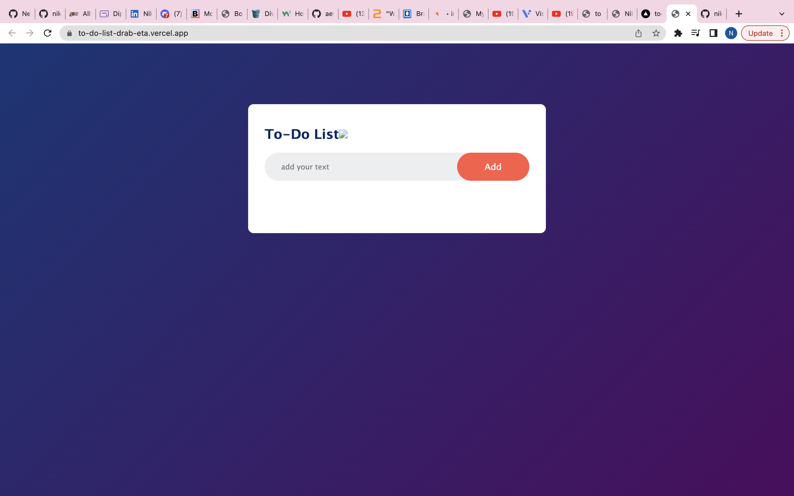
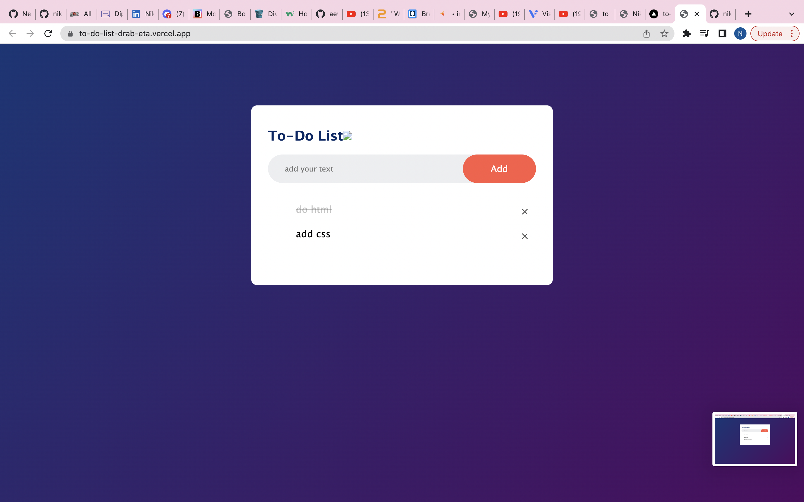

To Do List

live website - https://to-do-list-drab-eta.vercel.app/

You can add 3 items, cross out the ones you have done, and then delete it forever 

I used HTML, CSS3 and Javascript to create this project

Pictures below

Thanks
